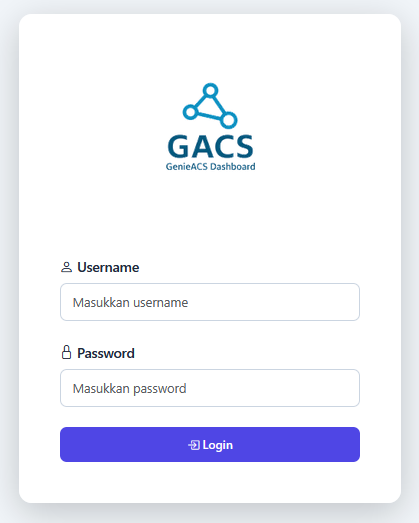
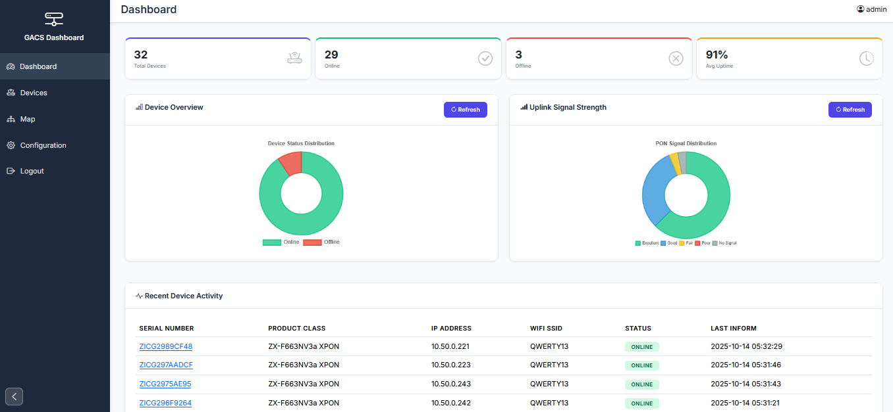
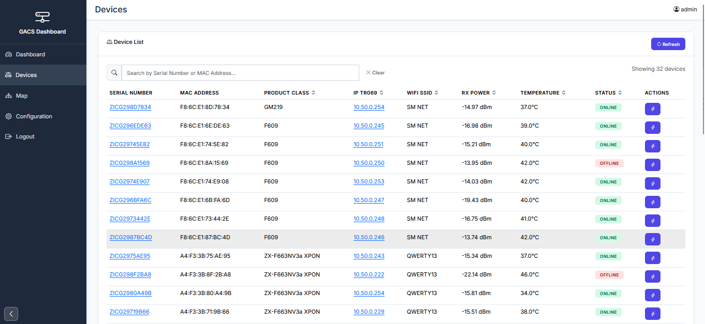
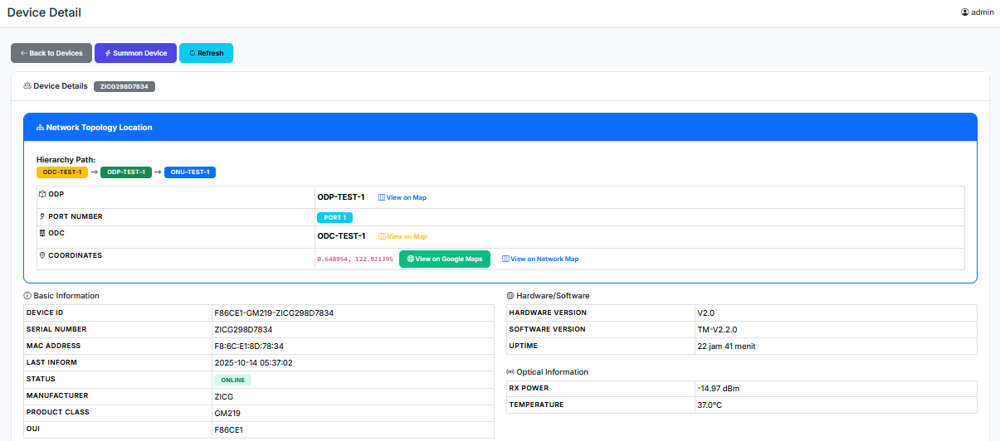
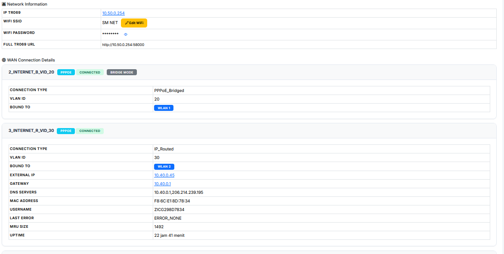
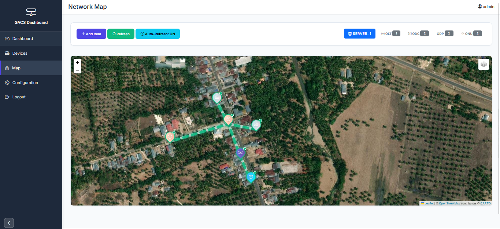
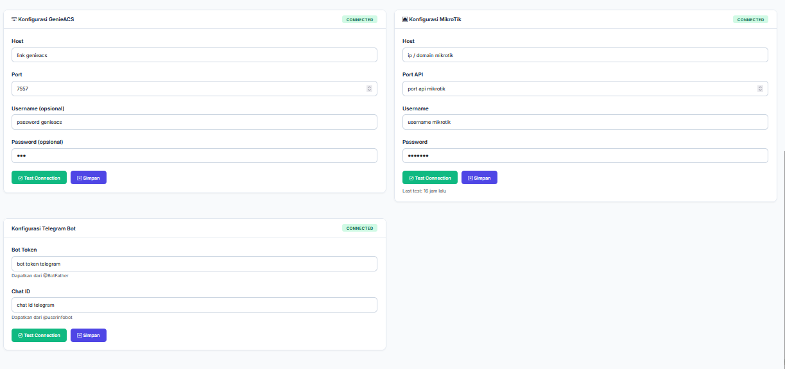

# GACS Dashboard v1.0.0-beta

<div align="center">


**GenieACS Network Monitoring Dashboard with PON Topology Visualization**

A powerful web-based dashboard for monitoring and visualizing GenieACS network topology with real-time monitoring, editable polylines, and Telegram integration.

[Features](#-features) • [Installation](#-quick-installation) • [Documentation](#-documentation) • [Screenshots](#-screenshots)

</div>

---

## 📋 Table of Contents

- [About](#-about)
- [Features](#-features)
- [Requirements](#-requirements)
- [Quick Installation](#-quick-installation)
- [Configuration](#-configuration)
- [Telegram Bot](#-telegram-bot-features)
- [Cron Jobs](#-automated-tasks-cron-jobs)
- [Production Deployment](#-production-deployment)
- [Screenshots](#-screenshots)
- [Troubleshooting](#-troubleshooting)
- [Documentation](#-documentation)
- [License](#-license)

---

## 🎯 About

GACS Dashboard is a PON fiber optic network monitoring platform integrated with GenieACS. It provides interactive topology visualization, real-time monitoring, and Telegram notifications for network infrastructure management.

Key Highlights:

- Interactive network topology map with editable connection lines
- Real-time device monitoring (ONU/ONT)
- Telegram bot with role-based access control
- PON power calculator for optical budgeting
- Responsive design for mobile & desktop

Note: This project is in beta testing. Please report any bugs.

---

## ✨ Features

### Core Features

- ✅ **Real-time Device Monitoring** - Real-time ONU/ONT status
- ✅ **Interactive Network Topology Map** - Drag-and-drop PON hierarchy visualization
- ✅ **Editable Connection Lines** - Customize connection paths with waypoints
- ✅ **PON Power Calculator** - Automatic optical power budget calculation
- ✅ **GenieACS Integration** - Full integration with the GenieACS TR-069 API
- ✅ **MikroTik API Support** - Monitor the status of your MikroTik router
- ✅ **Telegram Bot** - Multi-user bot with 11 granular permissions

### PON Topology Support

- **Server** → **ISP** → **MikroTik** → **OLT** → **ODC** → **ODP** → **ONU/ONT**
- Support splitter 1:2 to 1:64 + custom ratio (20:80, 30:70, 50:50)
- GPS coordinates for each device
- Auto power calculation via hierarchy

### Telegram Bot Features

- 🤖 **Interactive Menu** - Inline keyboard for all functions
- 🔐 **Role-Based Access** - 3 roles (Admin, Operator, Viewer) with 11 permissions
- 📊 **Device Management** - View, search, filter, summon devices
- 📶 **WiFi Configuration** - Edit SSID/Password via multi-step wizard
- 🗺️ **GPS Location** - Share device location with Google Maps link
- 📈 **Reports** - Daily/weekly automated reports with scheduling
- 🔔 **Notifications** - Subscribe per-device for status alerts

---

## 🖥️ Requirements

**Server:**

- Web server: Apache 2.4+ (with mod_rewrite) or Nginx 1.18+
- PHP: 7.4+ (8.0+ recommended)
- MySQL/MariaDB: 5.7+ / 10.3+
- Composer

**PHP Extensions:**

```
php-mysqli, php-json, php-curl, php-mbstring, php-xml
```

**External Services:**

- GenieACS instance (for device management)
- MikroTik Router (optional, for network status)
- Telegram Bot (optional, for notifications)

---

## 🚀 Quick Installation

### Step 1: Upload & Extract

```bash
# Update packages
sudo apt update && sudo apt upgrade -y

# Install Apache
sudo apt install apache2 -y

# Install PHP and extensions
sudo apt install php php-mysqli php-json php-curl php-mbstring php-xml -y

# Install MySQL
sudo apt install mysql-server -y

# Install Composer
sudo apt install composer -y

sudo systemctl restart apache2

git clone https://github.com/kintoyyy/GACS-dashboard

sudo cp -r GACS-dashboard/. /var/www/html/

cd /var/www/html
```

### Step 2: Install Dependencies

```bash
composer install --no-dev --optimize-autoloader
```

### Step 3: Create Database

```bash
# Via MySQL command line
mysql -u root -p -e "CREATE DATABASE gacs_production CHARACTER SET utf8mb4 COLLATE utf8mb4_general_ci;"
mysql -u root -p gacs_production < database.sql

# Or via phpMyAdmin:
# 1. Create database: gacs_production
# 2. Import: database.sql
```

### Step 4: Configure

```bash
# Copy template files
cp config/database.php.example config/database.php
cp config/config.php.example config/config.php

# Edit credentials database
nano config/database.php
```

Update your credentials:

```php
define('DB_HOST', 'localhost');
define('DB_USER', 'root');
define('DB_PASS', 'your_password');
define('DB_NAME', 'gacs_production');
```


### Step 5: Set Permissions

```bash
# Set ownership (adjust user for your hosting)
chown -R www-data:www-data /var/www/html

# Set permissions
find /var/www/html -type d -exec chmod 755 {} \;
find /var/www/html -type f -exec chmod 644 {} \;

# Secure sensitive files
chmod 600 /var/www/html/config/database.php
chmod 600 /var/www/html/config/config.php
```

### Step 6: Test Installation
1. Open the browser: `https://your-domain.com`
2. Login with default credentials: 
- Username: `user1234` 
- Password: `mostech`
3. ⚠️ **CHANGE YOUR DEFAULT PASSWORD IMMEDIATELY!**

---

## ⚙️ Configuration

### 1. GenieACS Integration

1. Login → **Configuration** → **GenieACS** tab
2. Enter: Host, Port (7557), Username, Password
3. Click **Test Connection** → **Save**

### 2. MikroTik API

1. Configuration → **MikroTik** tab
2. Enter: Host, Port (8728), Username, Password
3. Test & Save

### 3. Telegram Bot

1. Configuration → **Telegram** tab
2. Enter: Bot Token (from @BotFather), Chat ID
3. Test & Save
4. Set webhooks:

```bash
curl "https://api.telegram.org/bot<TOKEN>/setWebhook?url=https://your-domain.com/webhook/telegram.php"
```

5. Create admin user:

```sql
INSERT INTO telegram_users (chat_id, username, first_name, role, is_active)
VALUES ('YOUR_CHAT_ID', 'username', 'Your Name', 'admin', 1);
```

---

## 🤖 Telegram Bot Features

### Main Menu Commands

```
/start, /menu - Show main menu
/help - Command list
/stats - Dashboard statistics
/list - Browse all devices (10 per page)
/status <id> - Device details
/search <keyword> - Search devices
/summon <id> - Force device connection request
/subscriptions - View your subscriptions
```

### Admin Commands

```
/whoami - View your roles & permissions
/users - List all users
/user <chat_id> - View user details
/setrole <chat_id> <role> - Change user role (admin/operator/viewer)
/activate <chat_id> - Activate user
/deactivate <chat_id> - Deactivate user
```

### Reports Commands

```
/report daily - Generate daily report now
/report weekly - Generate weekly report now
/schedule daily HH:MM - Schedule daily reports
/schedule weekly <day> HH:MM - Schedule weekly reports
/schedule list - View active schedules
```

### Role-Based Access

- **👑 Admin** - Full access (11 permissions) - user management, WiFi edit
- **⚙️ Operator** - Device management (8 permissions) - summon, subscribe, reports
- **👁️ Viewer** - Read-only (4 permissions) - view devices, statistics

**Auto-Registration:** New users auto-register as "viewer" on first interaction.

### Interactive Features

- 📊 **Device List** - Pagination (10/page) with Previous/Next buttons
- 📶 **WiFi Edit** - Multi-step wizard (SSID → Password → Confirm)
- 🗺️ **GPS Location** - View coordinates, Google Maps, Network Map links
- 📍 **Location Sharing** - Send actual Telegram GPS pin
- 🔔 **Notifications** - Subscribe per-device for status changes

---

## 📅 ​​Automated Tasks (Cron Jobs)

### Required Cron Jobs

```bash
# Edit crontab
crontab -e

# Add these lines (adjust paths):
# Device monitoring - every 5 minutes
*/5 * * * * /usr/bin/php /path/to/cron/device-monitor.php >> /var/log/gacs-monitor.log 2>&1

# Webhook monitoring - every 5 minutes
*/5 * * * * /usr/bin/php /path/to/cron/webhook-monitor.php 2>&1 | logger -t webhook-monitor

# Database backup - daily at 2 AM
0 2 * * * /path/to/cron/backup.sh >> /var/log/gacs-backup.log 2>&1

# Scheduled reports - every hour (check for pending reports)
0 * * * * /usr/bin/php /path/to/cron/send-scheduled-reports.php >> /var/log/gacs-reports.log 2>&1
```

### Test Cron Jobs Manually

```bash
# Test device monitor
php /path/to/cron/device-monitor.php

# Test webhook monitor
php /path/to/cron/webhook-monitor.php

# Test backups
bash /path/to/cron/backup.sh
```

---

## 🏭 Production Deployment

### Pre-Deployment Checklist

```bash
# 1. Backup existing data
mysqldump -u username -p database > backup_$(date +%Y%m%d).sql
tar -czf backup_files_$(date +%Y%m%d).tar.gz /var/www/html/

# 2. Set secure permissions
chmod 600 config/database.php config/config.php
find . -type d -exec chmod 755 {} \;
find . -type f -exec chmod 644 {}\;

# 3. Disable PHP error display
# Edit php.ini:
display_errors = Off
log_errors = On
```

### Security Hardening

- ✅ Enable HTTPS (Let's Encrypt recommended)
- ✅ Change default password immediately
- ✅ Configure firewall rules (UFW/iptables)
- ✅ Enable fail2ban for brute-force protection
- ✅ Restrict file access (.htaccess already configured)
- ✅ Delete example files after setup

### SSL Certificate (Let's Encrypt)

```bash
# Install Certbot
sudo apt install certbot python3-certbot-apache # For Apache
sudo apt install certbot python3-certbot-nginx # For Nginx

# Obtain certificate
sudo certbot --apache -d your-domain.com
# OR
sudo certbot --nginx -d your-domain.com

# Auto-renewal test
sudo certbot renew --dry-run
```

### Apache Virtual Host Example

```apache
<VirtualHost *:443> 
ServerName your-domain.com 
DocumentRoot /var/www/html

SSLEngine on 
SSLCertificateFile /etc/letsencrypt/live/your-domain.com/fullchain.pem 
SSLCertificateKeyFile /etc/letsencrypt/live/your-domain.com/privkey.pem 

<Directory /var/www/html> 
Options -Indexes
+FollowSymLinks 
AllowOverride All 
Require all granted 
</Directory> 

ErrorLog ${APACHE_LOG_DIR}/gacs-error.log 
CustomLog ${APACHE_LOG_DIR}/gacs-access.log combined
</VirtualHost>
```

---

## 📸 Screenshots

### Login Page



### Dashboards



### Device List



### Device Details - Part 1



### Device Details - Part 2



### Network Topology Map



### Configuration Menu



---

## 🔧 Troubleshooting

### Database Connection Error

```bash
# Check credentials
cat config/database.php

# Test MySQL connection
mysql -u your_user -p -e "SELECT 1;"

# Verify database exists
mysql -u your_user -p -e "SHOW DATABASES;"
```

### Map Not Loading

1. Check browser console (F12) for errors
2. Verify Leaflet.Editable.js exists: `ls -la assets/js/`
3. Clear browser cache (Ctrl+Shift+R)
4. Check GenieACS connection in Configuration

### Telegram Bot Not Responding

```bash
# Check webhook status
curl "https://api.telegram.org/bot<TOKEN>/getWebhookInfo"

# Reset webhook
curl "https://api.telegram.org/bot<TOKEN>/setWebhook?url=https://your-domain.com/webhook/telegram.php"

# Check webhook access
curl https://your-domain.com/webhook/telegram.php
```

### Cron Jobs Not Running

```bash
# Check cron service
systemctl status cron

# View cron logs
grep CRON /var/log/syslog

# Verify crontab
crontab -l

# Test scripts manually
php /path/to/cron/device-monitor.php
```

### WiFi Edit Not Working

**Possible causes:**

- User lacks permission (Admin only)
- Device offline
- GenieACS not configured

**Solution:**

1. Verify user has `device.edit_wifi` permission (Admin role)
2. Check device status (must be online)
3. Test GenieACS connection: Configuration → Test Connection
4. For queued tasks (HTTP 202), wait for device inform or reboot device

---

### Key Documentation Sections

#### Installation

- Requirements & dependencies
- Database setup & import
- Configuration files
- Permission setup
- Test installation

#### Deployments

- Pre-deployment checklist
- Web server configuration (Apache/Nginx)
- SSL certificate setup
- Security hardening
- Post-deployment testing

#### Telegram Bot

- Setup instructions
- Main menu & commands
- Interactive features (WiFi edit, GPS location)
- Role-based permissions
- Multi-step wizards
- Report scheduling

#### Cron Jobs

- Device monitoring (status notifications)
- Webhook monitoring (auto-reset)
- Database backup (daily)
- Scheduled reports
- Log cleanup

#### Architecture

- Database schema (25 tables + 1 view)
- Core libraries (GenieACS, MikroTik, PON Calculator, Telegram Bot)
- Entry points & API endpoints
- PON topology system
- Map visualization
- Security considerations

---

## 📦 Files Structure

```
gacs-dashboard/
├── api/ # API endpoints
│ ├── map-*.php # Map operations
│ ├── get-devices.php # Device data
│ └── update-wifi-config.php
├── assets/
│ ├── css/ # Stylesheets
│ └── js/ # JavaScript (Leaflet.Editable.js)
├── config/ # Configuration
│ ├── config.php # App config
│ └── database.php # DB credentials
├── cron/ # Cron jobs
│ ├── device-monitor.php
│ ├── webhook-monitor.php
│ └── backup.sh
├── lib/ # Core libraries
│ ├── GenieACS.php
│ ├── MikroTikAPI.php
│ ├── PONCalculator.php
│ ├── TelegramBot.php
│ └── PermissionManager.php
├── webhooks/
│ └── telegram.php # Telegram webhook
├── views/ # View templates
├── dashboard.php # Main dashboards
├── devices.php # Devices page
├── device-detail.php # Device details
├── map.php # Network map
├── configuration.php # Settings
├── database.sql # Unified schema (25 tables)
└── README.md # This file
```

---

## 🔄 Version History

### v1.0.0-beta (Current - October 2025)

- ✅ Initial beta release
- ✅ Core dashboard functionality
- ✅ Interactive network topology map with editable polylines
- ✅ GenieACS, MikroTik, Telegram integrations
- ✅ PON power calculator
- ✅ Multi-user Telegram bot with RBAC (11 permissions)
- ✅ WiFi editing via Telegram with a multi-step wizard
- ✅ GPS location sharing & map integration
- ✅ Scheduled reports (daily/weekly)
- ✅ Device monitoring & notifications
- ✅ Automated backup & webhook monitoring
- ✅ Database consolidation (25 tables + 1 view)
- ✅ Universal deployment package
- ✅ Production-ready security hardening

---

## 🤝 Contributing

Contributions are welcome! If you'd like to contribute:

1. Fork the repository
2. Create feature branch (`git checkout -b feature/AmazingFeature`)
3. Commit changes (`git commit -m 'Add some AmazingFeature'`)
4. Push to branch (`git push orwant feature/AmazingFeature`)
5. Open Pull Request

**Guidelines:**

- Follow existing code style
- Write clear commit messages
- Test your changes thoroughly
- Update documentation if needed

---

## 📞 Support

If you encounter issues or have questions:

- 📝 **Issues:** Open issue in GitHub repository
- 📖 **Documentation:** See complete documentation files above
- 🔍 **Troubleshooting:** Check troubleshooting section
- 💬 **Community:** Join the discussion at GitHub Discussions

---

## 📄 License

This project is licensed under the **MIT License** - see LICENSE file for details.

---

## 🙏 Credits

**Developed by:** Mostech
**Special Thanks:**

- GenieACS community
- Leaflet.js team
- All contributors and testers

---

<div align="center">

**Created with ❤️ for Network Administrators**

[⬆ Back to Top](#gacs-dashboard-v100-beta)

---

**GACS Dashboard v1.0.0-beta** | **Status: Production Ready** ✅

</div>